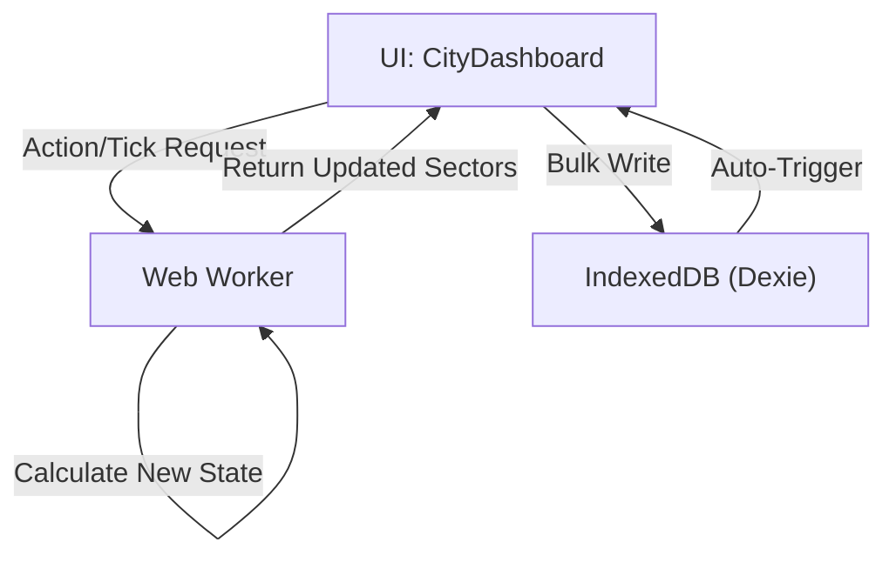

# City Dashboard & Simulation Layer

## Overview

The City Dashboard is the core interface for the Red Markets economy simulation. It visualizes the supply/demand state of all 10 sectors within a city and allows the user to intervene via Actions (Market, Sabotage, etc.) or advance time (Tick).

## Architecture: The Reactive Loop

The dashboard uses a **Local-First, Reactive** architecture. Instead of managing complex React state for the economy, the IndexedDB (Dexie) acts as the single source of truth.

1. **Read (Reactive):** The `useCityData` hook uses `useLiveQuery` to subscribe to database changes. Any update to a sector (from any source) immediately triggers a re-render of the Dashboard.
2. **Write (Transactional):** User actions are sent to a dedicated Web Worker to prevent UI freezing. The worker returns the new state, which is then bulk-written to IndexedDB in a single transaction.

## Key Components

### `CityDashboard`

The container controller. It handles:

* Data fetching via `useCityData`.
* Worker communication via `useSimWorker`.
* Orchestrating the "Tick" logic (updating all sectors + city timestamp).

### `SectorRow`

A pure presentation component for a single economic sector.

* **Visuals:** Renders Supply/Demand progress bars and Equilibrium badges.
* **Performance:** Lightweight; relies on parent re-renders (virtual DOM diffing) for updates.

### `ActionSelector`

An isolated form component for selecting specific market interventions (e.g., "Sabotage", "Speculate") and their magnitude.

## Hooks & Services

| Hook/Service | Purpose |
| :--- | :--- |
| **`useCityData`** | A reactive hook that returns the `City` and its sorted `Sector[]`. Automatically updates on DB changes. |
| **`useSimWorker`** | Manages the Web Worker instance. Handles message passing, correlation IDs, and "Busy" states. |
| **`sim.ts`** | Pure business logic functions (`tickSector`, `applyActionToSector`) used by the Worker. |
| **`sim.worker.ts`** | The background thread entry point. Handles CPU-intensive simulation tasks. |

## Data Flow: Simulation Ticks

When the user clicks **"Advance Time (Tick)"**:

1. Current sector state is sent to the Worker via `postMessage`.
2. Worker applies `tickSector()` to every sector (ambient noise, competition drift).
3. Worker returns the updated array.
4. Main thread writes the new sectors and updates `City.lastTick` in an atomic transaction.
5. UI updates automatically via `useLiveQuery`.

## Future Extensions (Phase 2)

* **Equilibrium Gating:** `ActionSelector` will filter available actions based on the sector's current `Equilibrium` (e.g., cannot "Sabotage" a "Scarce" market).
* **Macro Events:** Ticks may trigger global events (e.g., "Food Shortage") injected by the Worker.