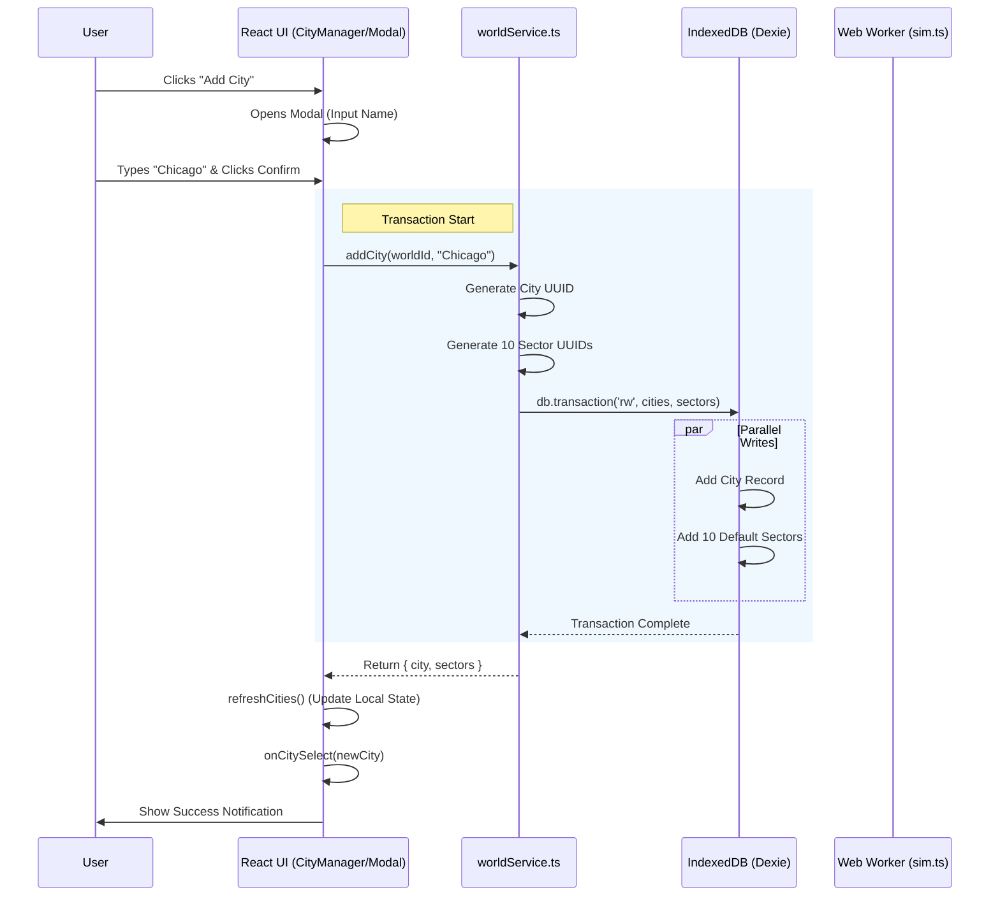

This process involves the UI (React), the Service Layer, the Database (Dexie), and the Simulation Logic.

### The Process Graph

---

### Step-by-Step Breakdown

#### 1. User Interaction (The Trigger)
*   **Location:** `CityManager.tsx` -> `handleAddCity`
*   The user clicks the **"Add City"** button.
*   Mantine Modal opens. The user types a name (e.g., "Chicago") and clicks **Confirm**.

#### 2. Service Call (The Logic)
*   **Location:** `worldService.ts` -> `addCity(worldId, name)`
*   The component calls the asynchronous service function.

#### 3. Data Preparation (In Memory)
*   **City Object:** A new City object is created with a unique ID (`crypto.randomUUID()`) and the current timestamp (`lastTick`).
*   **Sector Objects:** The service loops through the `ALL_SECTORS` constant (Food, Energy, etc.) and creates **10 Sector objects**.
    *   *Defaults:* Supply: 50, Demand: 50, Equilibrium: Volatile (calculated via `deriveEquilibrium` in `sim.ts`).

#### 4. Database Transaction (The Write)
*   **Location:** `db.ts` (Dexie)
*   The service opens a **Read-Write Transaction** touching both the `cities` and `sectors` tables.
*   It performs a **Bulk Put**:
    1.  Writes the 1 City record.
    2.  Writes the 10 Sector records.
*   *Why a transaction?* If writing the sectors fails, the city is not created, preventing "Ghost Cities" with no economy.

#### 5. UI Update (The Refresh)
*   **Location:** `CityManager.tsx`
*   The service returns the new `City` object.
*   **Step 5a:** `refreshCities()` is called to re-fetch the list from Dexie (ensuring the UI matches the DB).
*   **Step 5b:** `onCitySelect(city)` is called to immediately select the new city.
*   **Step 5c:** `CityDashboard` mounts. Its `useCityData` hook fires, fetching the 10 new sectors via `useLiveQuery`.

#### 6. Simulation Ready
*   The new city is now live. The `CityDashboard` displays the default 50/50 bars, and the Web Worker is ready to receive `tick` commands for this specific city ID.