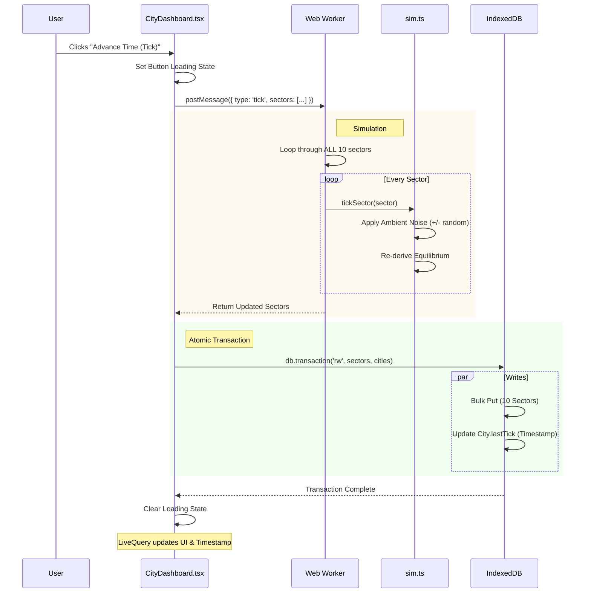

This is the most "heavy" operation because it affects **every sector** in the city simultaneously and updates the city's timestamp.

### The Process Graph

---

### Step-by-Step Breakdown

#### 1. User Interaction
*   **Location:** `CityDashboard.tsx`
*   User clicks the **"Advance Time"** button.
*   The button immediately shows a spinner (`loading={busy}`) because `useSimWorker` sets `busy = true`.

#### 2. Worker Execution
*   **Location:** `sim.worker.ts`
*   The worker receives the `tick` command.
*   It iterates through the array of 10 sectors.
*   It calls `tickSector()` on each one.
    *   **Noise:** Adds random drift (e.g., Supply +1, Demand -2).
    *   **Equilibrium:** Checks if the drift pushed any sector into a new state.

#### 3. Database Transaction (Atomic Update)
*   **Location:** `CityDashboard.tsx` -> `db.transaction`
*   This is the critical difference from "Apply Action".
*   We open a transaction that writes **two things**:
    1.  The **Sectors** (The simulation result).
    2.  The **City** (We update `lastTick` to `Date.now()`).
*   *Why Transaction?* We don't want the timestamp to update if the sector write fails (or vice versa). They must happen together to represent a coherent "Turn."

#### 4. Reactivity
*   **Location:** `useCityData.ts`
*   Dexie detects changes in *both* tables.
*   React re-renders.
    *   The "Last Update" text in the header changes to the current time.
    *   The bars wiggle slightly due to the noise.