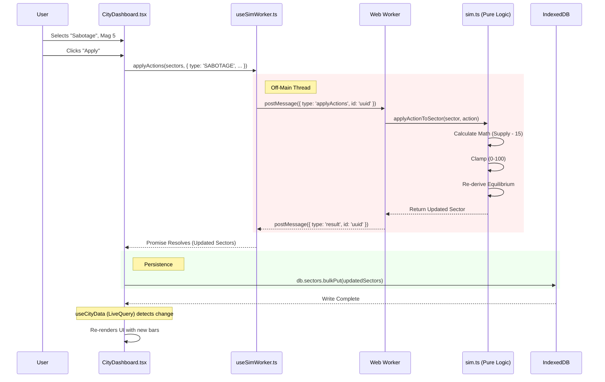

Here is the data flow for **Applying an Action** (e.g., "Sabotage Food Supply").

This flow is slightly more complex because it involves the **Web Worker** to keep the UI responsive during calculations.

### The Process Graph

---

### Step-by-Step Breakdown

#### 1. User Interaction
*   **Location:** `SectorRow.tsx` -> `ActionSelector`
*   User selects **"SABOTAGE"** and Magnitude **5**.
*   User clicks **Apply**.
*   The event bubbles up to `CityDashboard.tsx` -> `handleAction`.

#### 2. Worker Request (The Handoff)
*   **Location:** `useSimWorker.ts`
*   The UI thread is busy rendering, so we offload the math.
*   `CityDashboard` packages the *current* state of all sectors and the *requested* action.
*   It calls `applyActions()`.
*   The hook generates a unique **Correlation ID** and sends a message to the Worker.

#### 3. Simulation (Background Thread)
*   **Location:** `sim.worker.ts` -> `sim.ts`
*   The Worker receives the payload.
*   It calls `applyActionToSector` (pure function).
    *   **Math:** Supply `-= (4 * 5) = -20`.
    *   **Clamp:** Ensures Supply doesn't drop below 0.
    *   **Equilibrium:** Checks if the new Supply/Demand balance shifts the state (e.g., from Volatile to Scarce).
    *   **Derivations:** Recalculates CHIPS and Competition Dice based on the new Equilibrium.
*   The Worker sends the *new* Sector object back to the main thread.

#### 4. Persistence (The Commit)
*   **Location:** `CityDashboard.tsx`
*   The Promise resolves with the updated data.
*   The component calls `db.sectors.bulkPut()`.
*   *Why Bulk Put?* Even though we only changed one sector, the API supports updating multiple (e.g., for Macro Events), so we write the returned array.

#### 5. Reactivity (The Update)
*   **Location:** `useCityData.ts`
*   Dexie detects the write.
*   `useLiveQuery` fires automatically.
*   React re-renders `CityDashboard` with the new numbers.
*   The "Supply" bar shrinks visibly.

This architecture ensures that even if you have 100 cities simulating at once, the "Click" feels instant because the heavy lifting happens in the background and the UI just reacts to the database.